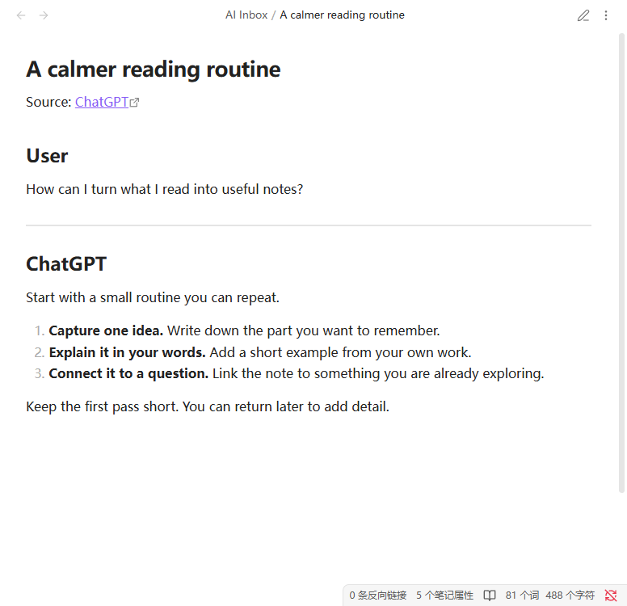

<h1 align="center">AI Inbox · Obsidian 插件</h1>

<strong>把 ChatGPT 对话，留在你的笔记里。</strong>

配合浏览器扩展，将完整对话和图片保存为可编辑的 Markdown。

<a href="README.md">English</a> · 简体中文 <a href="#功能">功能</a> · <a href="#安装">安装</a> · <a href="https://github.com/elfmedy/browser-ai-inbox/blob/main/README.zh-CN.md">浏览器扩展</a>

## 功能

- **留下完整对话。** 将当前聊天分支的全部消息保存为普通 Markdown，随时编辑和整理。
- **图片一起保存。** 图片遵循仓库的默认附件位置，离线也能查看。
- **保留你的修改。** 再次保存时更新未编辑的笔记；正文改过则另存带日期时间的新笔记。
- **内容按需保留。** 可选择是否保存思考摘要、是否在正文额外显示对话标题，两项默认关闭。
- **使用熟悉的语言。** 默认跟随 Obsidian，也可选择简体中文或 English。

## 安装

需要在同一台电脑上同时安装 **Obsidian 插件和 [Chrome / Edge 浏览器扩展](https://github.com/elfmedy/browser-ai-inbox/blob/main/README.zh-CN.md#安装)**。

1. 在 Obsidian 中安装并启用 **BRAT**。
2. 在 BRAT 设置中选择 **Add Beta plugin**，输入 `elfmedy/obsidian-ai-inbox`，添加并启用 **AI Inbox**。
3. 按照指南[安装浏览器扩展](https://github.com/elfmedy/browser-ai-inbox/blob/main/README.zh-CN.md#安装)。

要求 **Obsidian 桌面版 1.12.0+**。当前为 Alpha，尚未上架社区目录，主要在 Windows 上测试。

手动安装

从[最新 Release](https://github.com/elfmedy/obsidian-ai-inbox/releases/latest) 下载 `main.js` 和 `manifest.json`，放入仓库的 `.obsidian/plugins/ai-inbox/`，再启用插件。无需 `styles.css`。

## 开始使用

1. 保持目标 Obsidian 仓库打开。
2. 在 Chrome 或 Edge 中打开 ChatGPT 聊天，等待回复完成，点击 **AI Inbox** 图标。
3. 首次在 Obsidian 中确认连接，对话会保存到 **AI Inbox/**。

多个仓库时，选择一次即成为默认；之后可以右键浏览器扩展图标切换。Obsidian 或默认仓库未打开时，会提示保存失败。

## 按习惯调整

在 **设置 → AI Inbox** 中调整笔记目录、思考摘要、正文标题和界面语言。图片位置沿用 **设置 → 文件与链接 → 附件默认存放路径**。

设置在下次保存时生效，不批量修改旧笔记。保存规则、隐私和常见问题见[使用指南](docs/guide.zh-CN.md)。

## 更新

Obsidian 插件通过 BRAT 更新，[浏览器扩展](https://github.com/elfmedy/browser-ai-inbox/releases/latest)单独更新；需要两端同时升级时，Release 会明确说明。**0.4.0** 兼容浏览器扩展 **0.3.0 及以上版本**。

从 0.4.0 起，浏览器工程迁入独立仓库；已有 BRAT 安装继续使用原仓库地址和插件 ID。

---

[反馈问题](https://github.com/elfmedy/obsidian-ai-inbox/issues) · [版本更新](https://github.com/elfmedy/obsidian-ai-inbox/releases) · [开发说明](CONTRIBUTING.md) · [MIT 开源许可](LICENSE)
