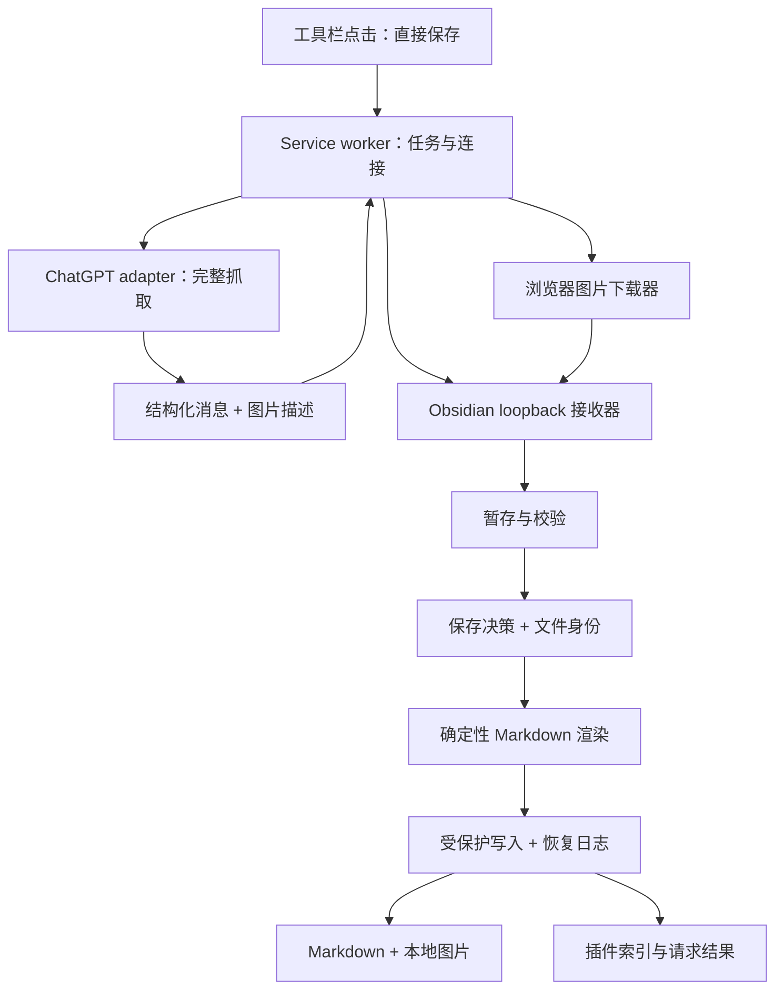

# AI Inbox 详细设计

版本：1.1 · 日期：2026-09-12 · 状态：开发设计基线，P0 原型已实现，实机验证尚未通过。

产品决策依据：`requirements-baseline.md` 与用户在当前任务中的确认。本文中的默认值、模块划分和异常策略为工程方案，可以依据原型证据调整；不得改变已确认的产品行为。

P0 补充约束：站内导航后的 hydration 可能属于旧聊天，不能只因存在 mapping 就接受。必须同时验证当前聊天身份、分支与页面最新状态；同一 ID 也不能证明内容新鲜。引用网站 favicon 已确认为 UI 图片，不能纳入内容图片下载清单。完整实测记录与尚未确定的取数路线见 `technical-spikes.md`；Obsidian 文件、API、许可和发布要求见 `../PUBLISHING.md`。

2026-09-12 开源复用修订：详见 `open-source-review.md`。新接口采用 `messages + page_info`，依据已审查的 MIT exporter 实现 `before=start_cursor` 前页读取；旧 mapping 保留独立分支校验。分页证据、完整消息内容与页面末尾需分别验证，DOM 转换器只负责已获取内容的保真。图片清单必须包括工具消息中的生成图；当前原型遇到此类图片会拒绝忽略，待资源适配完成再支持。引用和 Markdown 优先采用成熟模块，经保真样本通过后锁定依赖。原有一按钮、全聊天、图片落地、本地编辑后另存的规则不变。

## 1. 产品定义与边界

**一个保存按钮，将当前 ChatGPT 聊天的完整对话和图片保存到 Obsidian；重复保存时自动刷新或另存，保护本地编辑。**

### 1.1 首版包含

- Chrome Manifest V3 扩展、专用 Obsidian 桌面插件；Windows 为首个验收平台。
- 当前普通 ChatGPT 聊天，从第一条到最后一条的完整消息、顺序和角色；不受当前滚动位置限制。
- 段落、标题、列表、引用、链接、表格、代码块、行内代码、数学公式。
- 用户上传的图片、助手生成或在回复中展示的内容图片下载到 Vault，离线可读。
- 对话身份匹配、首次新建、未修改时刷新、已修改时另存、未变化时不写文件。
- 保留 frontmatter，跟踪同一 Vault 内改名与移动，日期时间版本命名。
- 网络失败反馈、幂等重试、崩溃恢复和必要的一次性连接流程。

### 1.2 首版不包含

- 消息/问答选择器、范围选择、保存模式、自动跟随、后台扫描账户聊天列表。
- 摘要、标签生成、知识拆分、模型 API Key、RAG 或对话内容加工。
- Claude/Gemini、移动端采集、账户历史批量导入、跨设备同时写入协调。
- PDF、音频、视频及其他非图片附件的下载；保留名称和可取得的链接，缺少可持久链接时显示来源说明。
- 独立 Canvas/Artifact 编辑器内容、工具执行日志、未呈现给用户的内部内容；若它们是完成某条消息所必需的内容，不能默默忽略后报“完整保存”。

### 1.3 “全部对话”的精确定义

保存当前聊天页面所选择对话路径的全部消息，包含滚动区外尚未加载的历史消息。用户编辑提问或重新生成回答时，保存当前选中的分支；不把互斥的旧回答插回同一条消息序列。这是对网页聊天的工程解释，不提供分支选择配置。

临时聊天、分享页面、群聊及无法取得稳定身份的特殊页面先识别为“不支持此页面”。这是首版支持矩阵，不能把它们误识别成普通聊天再截取一部分。若普通聊天的内容类型无法无损覆盖，明确报错，并把支持它作为原型/适配任务。

核心边界：**完整性无法确认，停止提交；不自动降级成仅保存可见消息。**

## 2. 用户流程与界面

### 2.1 首次连接

1. 用户安装并启用 Obsidian 插件，默认输出目录为 `AI Inbox/`。
2. 插件设置页提供“复制连接信息”，内容是版本化连接串，包含固定 loopback 端点、Vault ID 和随机令牌。
3. 未连接时，扩展显示一个连接输入框和“连接”按钮。粘贴一次，握手后显示目标 Vault 名称。
4. 连接完成后，扩展只显示主要操作“保存到 Obsidian”，并用次要文本显示连接的 Vault。

连接串不包含绝对 Vault 路径，不写入网页 DOM。地址固定为 `127.0.0.1`；不接受任意主机配置。插件提供重新生成连接信息的操作，旧令牌立即失效。修改接收文件夹在 Obsidian 设置中进行。

设计默认端口 `27125`，尚未在目标机器验证占用情况；占用时报明确错误，Obsidian 高级连接设置允许更换端口，再复制连接信息。不扫描端口、不自动切换到另一个 Vault。首版扩展一次绑定一个 Vault。

### 2.2 日常保存

正式入口按用户指定 UI 任务修订：点击 Chrome 工具栏图标立即保存，不先打开弹窗；图标始终保持同一外观和保存 tooltip，不展示上次结果或徽标。网页右下角单卡显示当前进度与结果。进行中再次点击恢复进度而不重复提交；设置与最近状态从右键入口进入。完整交互规则见 `interaction-design.md`。P0 弹窗仅是技术测试工具。

```text
AI Inbox
保存到：我的知识库

[ 保存到 Obsidian ]
```

没有每次预览、确认、选择文件、选择消息或选择模式。正常情况下不自动切换到 Obsidian，不打断当前聊天。

| 状态 | 文案与行为 |
| --- | --- |
| 就绪 | 保存到 Obsidian |
| 抓取 | 正在读取完整对话… |
| 图片 | 正在保存图片 3/8… |
| 提交 | 正在保存… |
| 首次成功 | 已保存到 Obsidian |
| 刷新成功 | 已更新笔记 |
| 本地改过 | 已另存新笔记，保留了你的编辑 |
| 无变化 | 已是最新内容 |
| 未连接 | 连接 Obsidian |
| Obsidian 未运行 | 请打开目标 Obsidian 仓库后重试 |
| 正在生成 | 回复尚未完成，请完成后再保存 |
| 无法完整抓取 | 未能读取完整对话，请重新加载聊天后重试 |
| 图片失败 | 图片未保存完成，本次未提交笔记。请重试 |
| 结果不确定 | 正在确认保存结果…；恢复失败时提示重新打开目标仓库后重试 |

按钮在同一任务运行时禁用；失败后同一按钮变为“重试”。任务详情仅在错误时展开，展示可理解的原因，不展示 hash、事务、分支等内部概念。

首次访问尚未授权的图片来源可能出现浏览器自身的站点权限提示；这是浏览器权限约束，不设计成每张图片的确认流程。已授权来源不重复询问。

## 3. 保存语义

### 3.1 当前更新目标

每条聊天以 `provider + conversationId` 作为身份，在一个 Vault 内维护一个 `latestNoteId`。原始聊天 URL 中的稳定 ID 由适配器验证，标题不是身份。

例子：

```text
第一次保存                  → 设计讨论.md                 （目标 A）
ChatGPT 继续聊，A 没改       → 更新 A
用户编辑 A，再次保存        → 设计讨论 2026-09-10 213045.md （目标 B）
ChatGPT 没变化，B 没改       → 不写入
用户编辑 B，再次保存        → 设计讨论 2026-09-11 091530.md （目标 C）
```

A、B 成为历史笔记后不再参与更新。用户把 A 撤销回旧内容，也不会重新把 A 设成当前目标。

### 3.2 判定顺序与行为矩阵

先处理同一请求的恢复/重放，再校验快照和图片完整性，再定位目标，最后执行下表。网络重试不是新的用户保存动作。

| 当前目标 | 本地正文/内容图片 | 来源内容 | 行为 |
| --- | --- | --- | --- |
| 从未保存 | — | 完整 | 新建笔记 |
| 可可信定位 | 未改 | 未变 | 不写笔记；缺失图片按 7.4 修复 |
| 可可信定位 | 未改 | 变化 | 原路径刷新正文，保留当前 frontmatter |
| 可可信定位 | 已改 | 未变或变化 | 保留旧文件，创建日期时间新文件并成为目标 |
| 已删除 | — | 完整 | 下次主动保存新建；不恢复旧路径、不碰历史版本 |
| 身份不明确/索引基线丢失 | 无法判断 | 完整 | 保守新建，不收编已有文件作为可覆盖目标 |
| 任意 | 任意 | 不完整/图片不全 | 失败，旧笔记与索引目标不变 |

“本地修改”先于“来源是否变化”。禁止先按 sourceHash 相同短路，否则会违反用户确认的另存规则。

### 3.3 本地修改判定

- **正文**：去除合法的文件开头 YAML frontmatter 后，剩余正文做 SHA-256 比较。
- 仅统一 CRLF/LF（作为同一种换行）；不 trim，不合并空白，不删除尾随空格，不重排正文，不做 Unicode 兼容归一化。代码缩进、空行、Markdown 硬换行、标题修改均可触发另存。
- **Frontmatter**：不参与正文 hash。刷新时保留当前文件 frontmatter 原文，包括未知字段、注释、顺序和格式；不重建整个 YAML 对象。
- 无闭合分隔符、无法可靠分离的 frontmatter：不猜测正文边界，保守另存。
- **改名/移动**：身份可信且正文未变时，在用户移动后的路径更新，不搬回 Inbox，不自动改回原标题。
- **用户修改导出的图片文件**：视为本地内容编辑，同样保护并另存；不能让新导入恢复旧图片覆盖用户的修改。
- 用户修改插件身份属性或移除全部 frontmatter：不当成可覆盖的可信目标，保守另存；“不因 properties 编辑触发正文变更”不等于忽略身份损坏。

只恢复完全相同的正文时，可视为未修改；首版不维护“曾经编辑过”的永久标记。

## 4. 系统架构与代码边界



| 模块 | 职责 | 不承担 |
| --- | --- | --- |
| extension/ui | 按钮、进度、连接、重试 | 消息范围或保存策略选择 |
| extension/background | 请求 ID、状态恢复、限流、凭据、传输 | Vault 路径和覆盖判断 |
| extension/adapters/chatgpt | 对话识别、全部消息、分支路径、内容转换 | 写文件和任意网络代理 |
| extension/assets | 获取实际图片字节、检查重定向、缓存 | 把登录凭据发给 Obsidian |
| packages/protocol | JSON Schema/运行时校验、消息类型、错误码 | 平台抓取逻辑 |
| packages/core | 规范化、hash 输入、Markdown 渲染、保存决策 | DOM、Chrome API、Obsidian API |
| plugin/transport | loopback 鉴权、暂存请求、接口限制 | 下载外部 URL |
| plugin/persistence | 目标定位、图片和笔记保存、基线、恢复 | 猜测网页结构 |

技术建议：TypeScript strict，npm workspaces，esbuild 打包，Vitest 做核心与故障注入测试；反馈卡及设置页使用轻量 DOM 与平台原生 UI。首版不引入后端框架、数据库服务、React 大型界面或模型 SDK。依赖实际版本在 P0/P1 锁定并记录，不在设计阶段凭空指定。

Obsidian manifest 标记桌面专用。插件只用 Node 能力实现本机接收，不启动独立常驻程序；笔记和资源优先使用 Vault API；插件索引使用 `loadData/saveData`，隐藏暂存区使用 Adapter API。

## 5. 抓取与完整性

### 5.1 适配器契约

```ts
interface SourceAdapter {
  identify(): Promise<SourceIdentity>;
  captureComplete(signal: AbortSignal): Promise<CaptureDraft>;
  resolveImage(asset: ImageDescriptor): Promise<ResolvedImage>;
}

interface CaptureDraft {
  identity: SourceIdentity;
  sourceTitle: string;
  messages: Message[];
  images: ImageDescriptor[];
  completeness: {
    status: "complete" | "incomplete" | "unsupported";
    evidence: string[];
    branchFingerprint: string;
    sourceRevision?: string;
  };
  adapterVersion: string;
}
```

`complete` 不是“页面没报错”。适配器需要从可验证的数据或历史加载流程确认起点、终点、消息顺序和当前分支，且捕获期间没有流式输出或分支切换。

### 5.2 技术取数路线与验证门槛

先验证当前页面可取得的数据：优先使用页面已取得的结构化消息，或能够验证完整性的 DOM/历史加载流程。若只能用 ChatGPT 网页内部读取接口，必须在独立适配器中隔离，实测会话认证、分页、分支和失败响应后再决定；不能把其当作官方稳定 API。

**本设计尚未验证当前登录聊天页面的 DOM、内部端点或图片认证方式。** P0 必须产出实测结论与匿名化样本，之后才锁定主路线。本次能读取分享对话不构成扩展已能抓取登录页面的证据。

DOM 路线必须主动处理历史加载与虚拟列表，去重后重建全部顺序；滚动到顶、没有新节点或看到最后一条消息单独都不是完整性证明。需要适配器版本对应的首尾/数量/父子关系验证。不能证明时终止。

抓取开始记录 conversationId 和分支指纹，结束再验证；中途导航、消息增加或生成继续则废弃本轮，提示稍后再保存。消息内容中的文字永远作为数据，不解释为扩展命令。

### 5.3 消息与 Markdown 支持

内部消息包含平台消息 ID（可获得时）、role、顺序及内容块。语义内容块支持文本、代码、列表、引用、表格、数学、图片和普通附件引用。清除复制按钮、头像、评分、导航和加载占位；保留回复的正文与来源链接。

Markdown 转换不摘要或润色，不把代码块内容当 HTML，不把数学图片当普通装饰图片。嵌套代码围栏长度由内容确定，表格转义管道符，数学优先保留原始 TeX。原文中的 `[[...]]` 与 `![[...]]` 应转义为字面文字，防止被误解成本地 Vault 引用；真实代码块保留原样。

HTML 中的 script/事件处理不执行、不持久化成可执行内容；不支持内容通过结构化错误报告，禁止仅返回 `innerText` 作为默认兜底。

## 6. 数据模型与 hash 规范

### 6.1 传输快照

```ts
type Provider = "chatgpt";
type Sha256 = string; // 64 位小写十六进制

interface ConversationSnapshot {
  schemaVersion: 1;
  provider: Provider;
  conversationId: string;
  sourceUrl: string;          // 规范化的当前聊天 URL，去除跟踪参数
  sourceTitle: string;
  capturedAt: string;         // UTC ISO 8601，仅描述采集时间
  branchFingerprint: string;
  sourceRevision?: string;    // 可选，只使用实测可解释的来源版本
  messages: Message[];
  assets: AssetManifestEntry[];
  completeness: { status: "complete"; evidence: string[] };
  adapterVersion: string;
  normalizationVersion: 1;
}

interface Message {
  sourceMessageId?: string;
  role: "user" | "assistant";
  blocks: ContentBlock[];     // 判别联合；完整定义与 Schema 在 P1 编写
}

interface AssetManifestEntry {
  assetId: string;            // 当前快照中唯一
  sourceAssetId?: string;
  mimeType: string;
  byteLength: number;
  sha256: Sha256;             // 实际保存字节的摘要
  alt: string;
}
```

签名下载 URL、Cookie、Authorization 不进入最终快照或 Obsidian 日志。图片下载定位信息仅存浏览器未完成任务缓存，成功/过期后清理。

### 6.2 三种摘要

| 字段 | 输入 | 用途 |
| --- | --- | --- |
| sourceHash | 固定版本的规范化标题、顺序、角色、正文内容块、图片实际字节摘要、非图片附件名称/稳定引用 | 来源内容是否变化 |
| renderedBodyHash | 最终写入正文的 UTF-8，统一 CRLF 为 LF | 判断用户是否修改正文 |
| payloadHash | 完整快照规范化 JSON，包含采集信息 | 同一请求 ID 是否传了不同载荷 |

sourceHash 排除 capturedAt、临时图片 URL、UI 状态、adapterVersion、文件路径、请求 ID；来源消息 ID/branchFingerprint 用于身份和诊断，不能让无内容变化的 ID 抖动制造更新。标题进入 sourceHash，但不触发已有文件改名。

JSON 对象键稳定排序，数组保持顺序，内容空白不随意删除。图片 URL 即使改变，只要实际图片字节未变，视为同一内容。获取到新图片字节才计算最终 sourceHash；不因 URL 看起来相同而跳过验证。

记录 normalizationVersion、rendererVersion 和 hashVersion。算法升级不直接把用户文件作为新基线；迁移未知时保守新建，待独立迁移测试通过后才启用兼容。

### 6.3 笔记格式

```markdown
---
source: chatgpt
conversation_id: "<稳定聊天 ID>"
source_url: "https://chatgpt.com/c/<ID>"
ai_inbox_id: "<笔记 UUID>"
captured_at: "2026-09-10T13:30:45Z"
---

# 设计讨论

## 用户

原始问题内容。

## 助手

原始回答内容。

![[AI Inbox/_assets/<digest>.png]]
```

`ai_inbox_id` 用于重命名与重定位，不是需要用户管理的状态。内部 hash 和请求日志不出现在笔记里。默认使用 Vault 路径图片嵌入，兼容 Obsidian；用户另行导出到外部 Markdown 时可转换链接。

`captured_at` 表示这份文件首次创建时的采集时间；更新正文时不修改任何现有 YAML，最后成功保存时间放插件索引。用户对 YAML 的修改即使是来源标题、时间等字段也不被重写。新建/另存笔记使用新快照的标准字段，不复制旧笔记的私人标签和项目属性。

### 6.4 插件索引

```ts
interface PluginState {
  schemaVersion: 1;
  vaultId: string;
  settings: { inboxFolder: string; port: number };
  conversations: Record<string, { latestNoteId: string; revision: number }>;
  notes: Record<string, NoteRecord>;
  requests: Record<string, RequestRecord>;
  requestTombstones: Record<string, { payloadHash: Sha256; expiredAt: string }>;
  pending?: PendingCommit; // 全局写入串行，因此最多一个提交事务
}

interface NoteRecord {
  noteId: string;
  conversationKey: string;
  path: string;
  sourceHash: Sha256;
  renderedBodyHash: Sha256;
  assets: { sha256: Sha256; path: string }[];
  createdAt: string;
  lastSavedAt: string;
  rendererVersion: number;
  normalizationVersion: number;
  retired: boolean;
}
```

RequestRecord 记录 payloadHash、接收顺序、客户端 ID、对话 revision 基线、状态、终态结果和过期时间。PendingCommit 包含旧记录、目标路径、noteId、预期旧/新全文 hash、暂存文件引用和待提交的新索引。历史 NoteRecord 仅保留轻量元数据，不复制完整聊天历史。

单独的 `.obsidian/plugins/ai-inbox/private/` 保存暂存与恢复文件；认证材料与可携带索引分开，重启后旧连接令牌可校验，日志不打印令牌。首版通过随机安装实例标识避免误接到另一个 Vault；凭据默认按本地敏感配置对待，不宣称插件目录同步能提供凭据隔离或多设备一致性。若后续支持多设备，必须单独设计设备凭据存储与状态合并。

## 7. 图片本地化

### 7.1 处理范围

识别对话内容中的实际图片，包含上传图、生成图、多图和回复内嵌图片。头像、按钮图标、加载骨架和仅用于显示公式的图片不作为附件下载。缩略图存在可取得原图时下载原图；只有缩略图而不能确认它代表完整图片时不假装保存原图，适配器需报告质量限制或失败。

支持 PNG、JPEG、WebP、GIF、AVIF 等浏览器实际返回的常用图片；扩展名由经过检查的 MIME/文件头决定。SVG 需经过专用静态校验，拒绝脚本、外部资源和活动内容；该路径在 P0/P3 验证。未经验证的图片格式明确报错，不把 HTML 登录页保存成图片。

### 7.2 下载与传输

1. 浏览器适配器解析图片引用，保留消息与图片的对应关系。
2. 图片下载器在已登录浏览器可用的权限上下文取得字节。普通 HTTPS 图片使用扩展 fetch；需要页面会话或 blob URL 的图片走经验证的来源适配流程。
3. 不获取或导出浏览器 Cookie，不将 ChatGPT 登录凭据交给本机插件。不能读取的 blob/受限跨域内容报错，不假定画布截图可以无损替代。
4. 下载字节存浏览器 IndexedDB 暂存，记录长度、MIME 和摘要。图片大于消息通道预算时使用有序分块，不将整张大图 base64 塞入单条 Chrome 消息。
5. 从扩展 service worker 向 Obsidian 发送二进制分块；Obsidian 复算摘要并验证完整长度。
6. 全部资产完成后才允许提交 Markdown，链接替换为最终 Vault 内图片路径。

普通外链图片只读取对话实际引用的 HTTPS 地址；重定向逐跳检查，拒绝 localhost、私网地址、非 HTTPS 和异常 scheme。来源域名按实测配置最小 host 权限；额外内容图片域使用 optional host permissions，批量申请本次需要的域，不默认 `<all_urls>`。对第三方图片不附带 ChatGPT 凭据。

### 7.3 存储和不覆盖原则

默认目录：`AI Inbox/_assets/`，文件名使用完整 SHA-256 + 实际扩展名。同字节图片可复用，但复用前检查文件实际摘要；已存在且内容不符时不覆盖，创建不冲突的新路径并更新本次引用。

刷新笔记不会清理旧图片。历史笔记可能仍然引用这些文件，首版不提供自动垃圾回收。用户可以通过自己的附件管理方式整理。暂存文件可以按明确的任务归属与期限清理，已经发布到 Vault 的图片不自动删。

用户移动笔记不改变 Vault 路径图片引用；如果 Obsidian 自动改写引用使正文变化，保守视为本地正文修改。图片本身移动后可以通过仍可解析的当前引用识别；无法判明时不覆盖旧文件。

### 7.4 失败、缺失与修改

- 任一必需图片下载失败：本次不提交笔记、不推进 latestNoteId；保留限时暂存用于重试。不能显示完整成功或用远程图片悄悄代替。
- 当前笔记引用的本地图片缺失、正文未改：下次保存可从来源补回同摘要图片；不把“已是最新”当成无需检查资源。
- 本地图片内容变更：当作用户编辑，另存笔记并使用新的、经过字节验证的资源文件，不覆盖用户图片。
- 用户删除或替换图片链接已导致正文改变：依照正文编辑规则另存，不修补旧笔记。
- 来源签名 URL 过期：重新从当前聊天解析引用。重新解析后内容发生变化时产生新的快照；已绑定旧 payloadHash 的请求 ID不能复用。

## 8. 本机通信契约

### 8.1 安全与连接

只绑定 `127.0.0.1`，禁止绑定所有网卡。每个请求校验 Bearer token 和 `X-AI-Inbox-Vault`；已配对的 extension ID/客户端标识用于来源检查。鉴权是主要边界，不能只依赖 CORS。

令牌使用至少 256 位随机数，比较使用恒定时间方式；浏览器存 `chrome.storage.local` 并设置访问范围为 `TRUSTED_CONTEXTS`。可行时 Obsidian 只保存令牌校验摘要，生成连接信息后不记录明文日志。

仅提供握手、快照暂存、图片上传、提交和请求状态；没有读任意笔记、删除文件、运行命令或指定写入路径的接口。入站 JSON/二进制长度限制在解析前生效。标题、链接、role 和块类型都做运行时 Schema 校验。

### 8.2 接口表

所有路径在 `/v1` 下，所有接口均鉴权；响应带 `protocolVersion` 和 `vaultId`。任何客户端传入的绝对路径都不接受。

| 方法与路径 | 输入/结果 | 幂等语义 |
| --- | --- | --- |
| GET `/hello` | 返回 Vault 显示名、协议能力、大小限制、服务实例 ID | 只读；扩展校验绑定的 Vault |
| POST `/captures` | `{requestId, clientId, payloadHash, snapshot}`；返回已暂存及缺失图片摘要 | 同 ID 同载荷返回已有状态；同 ID 不同载荷 409 |
| PUT `/captures/{id}/assets/{digest}/chunks/{n}` | 二进制块，长度/块摘要在头部；返回已接收 | 同块重放同内容成功；不同内容 409 |
| POST `/captures/{id}/commit` | 请求执行提交；返回 202 或已完成结果 | 反复调用不会多次另存 |
| GET `/captures/{id}` | 状态、进度、可重试错误或终态结果 | 只读；只返回本客户端可访问的任务 |

第一块定义资源总长度、总块数、MIME，后续不允许更改。块上传完成时组装并复算文件摘要；只有 manifest 中声明的图片可上传。分块大小默认 1 MiB，图片并发默认 2，均为内部常量，不提供日常选项。

POST `/captures` 在接收时记录服务器对话 revision，并登记该客户端/对话的递增接收序号。若准备期间另一请求已经提交，新请求提交时检测 revision 不匹配或已被后续请求取代，返回 `STALE_REQUEST`；旧内容不得因上传慢而覆盖新结果。扩展重新读取当前聊天再创建新请求，不重放旧快照来绕过版本冲突。

一次新的用户点击仍以当时当前分支为权威：来源变短可能是编辑历史或切分支，不能仅凭消息数变少拒绝。完整性证据决定是否允许；客户端 capturedAt 不作为来源新旧顺序的证据。

### 8.3 终态和错误

```ts
interface SaveResult {
  requestId: string;
  status: "completed";
  action: "created" | "updated" | "forked" | "unchanged" | "assets-restored";
  noteId: string;
  notePath: string; // Vault 内相对路径，仅用于 UI
  completedAt: string;
}
```

错误对象统一 `{code, message, retryable}`。HTTP 400 对应非法 Schema，401 无效凭据，409 ID 冲突/过期 revision，413 超限，422 内容或图片校验失败，503 存储不可用/恢复中。扩展按 code 映射用户文案，不直接展示服务堆栈。

重要业务码：`UNSUPPORTED_PAGE`、`CAPTURE_INCOMPLETE`、`SOURCE_CHANGED`、`SOURCE_GENERATING`、`ASSET_FETCH_FAILED`、`ASSET_INVALID`、`WRONG_VAULT`、`STALE_REQUEST`、`IDEMPOTENCY_CONFLICT`、`PERSISTENCE_FAILED`、`RECOVERY_REQUIRED`。

## 9. 文件定位、命名和更新

### 9.1 文件身份

优先用 NoteRecord.path 定位并校验 `ai_inbox_id`、来源身份。Vault rename 事件更新索引；离线改名或路径失效时按 noteId 在 Markdown metadata 中查找，再读取真实内容验证。

唯一匹配且原有 hash 基线可信时恢复映射；多个匹配（复制笔记导致重复 ID）且无法确定原对象时保守新建。若原 path 仍指向已知身份的文件，新增副本不改变当前目标。禁止用相同标题、相似文本或“最新修改时间”猜测目标。

用户改写/删除身份字段、索引损坏或升级无法解释时：保留已有文件，新保存创建自己的新身份。不能读取当前文件 hash 然后宣布它是“上次生成的内容”。

### 9.2 命名

- 首次：`<安全标题>.md`。
- 另存：`<安全标题> YYYY-MM-DD HHmmss.md`，时间来自 Obsidian 本机保存时刻，使用本地时区；frontmatter 时间使用 UTC。
- 同秒或同名碰撞：增加 `-2`、`-3`，实际创建返回冲突则重新分配，绝不覆盖。
- 去除 Windows 非法文件名字符、路径分隔符、尾随空格/点；规避 CON、NUL 等保留名；空标题用“ChatGPT 对话”。
- 标题部分默认限制为 80 个 Unicode 字符，实际还需按完整路径长度收缩；保留日期与序号。标题不允许注入目录。
- 更新既有笔记时不重命名、不改变目录；更改 Inbox 设置只影响以后新建及另存文件。已管理的资源路径按索引继续使用。

### 9.3 写入保护

网络下载、渲染和 hash 等耗时工作先完成。真正写入前，在串行提交队列内重新定位目标并核验正文、身份、图片状态和 editor buffer。

使用 `Vault.process()` 的同步回调对当前内容进行最终比较：若与准备时内容不一致，抛出内部可识别的重规划信号，不返回覆盖结果；重新规划，正文已改则另存，仅 YAML 改了则以最新 YAML 重建并重新准备日志。回调中不等待网络或异步 hash。

打开编辑器的未落盘正文与上次生成正文不同，也算本地修改并触发另存。若仅 frontmatter 缓冲不同，等待正常落盘后重规划并保留最新属性，不强制写回编辑器、不因此另存；等待超时提示稍后重试。多个编辑视图都要检查；遇到无法可靠区分正文与属性的状态，保守新建。P0/P2 必须在真实 Obsidian 中验证编辑器自动保存与 `Vault.process()` 的交互。

官方 Vault API 提供受控读改写接口；它不是跨 Obsidian、外部编辑器、同步软件和多个设备的分布式锁。首版目标是在单个 Obsidian 写入实例中保护编辑；不承诺抵挡绕过应用的并发磁盘写入。对应用能检测的外部变化采取重新读取/另存。[官方 Vault 文档](https://docs.obsidian.md/Plugins/Vault)

## 10. 崩溃恢复与请求重试

### 10.1 状态机

```text
received → receiving-assets → ready → committing → completed
                      ↘ failed-retryable
                      ↘ failed-terminal
```

提交为全局单队列，图片下载可并行。插件启动先恢复 pending，再接受新提交；不能一边恢复一边覆盖相同文件。

### 10.2 提交步骤

1. 验证 payloadHash、全部图片、当前 revision 与请求幂等状态。
2. 定位笔记，决定 create/update/fork/unchanged，分配 noteId 与不会覆盖的文件路径。
3. 计算最终 Markdown 和完整前后 hash；保存暂存内容。更新场景保存旧全文恢复副本，副本仅用于故障诊断，不自动恢复覆盖用户后来编辑。
4. 通过 `saveData` 持久化 PendingCommit 和目标路径；成功后才允许发布图片/笔记。索引版本和日志状态带校验及备份，不能把 API 返回当作多文件原子事务。
5. 将全部图片发布到 Vault 的独占或已验证路径，既有不同内容不覆盖。途中失败允许残留未引用的新图片，不允许旧笔记变成半更新。
6. 创建新 Markdown 或通过受保护 process 更新。最终内容变化时回到第 2 步，旧 pending 先安全失效并重新写入，不能沿用错误的预期 hash。
7. 验证写后内容及 noteId，再一次保存新索引、请求终态和清除 pending。
8. 只有第 7 步成功后返回 completed；清理过期暂存失败不撤销已提交结果。

### 10.3 恢复判断

| 重启时发现 | 恢复行为 |
| --- | --- |
| 只有暂存，尚无 PendingCommit | 可继续接收或按 TTL 清理；不改笔记 |
| pending 存在，目标仍为预期旧内容 | 尚未确认写入；重新验证后继续该请求 |
| pending 存在，目标为预期新全文与 noteId | 补齐索引和请求结果，不再写一份笔记 |
| pending 为新建，但路径不存在 | 使用原请求身份重新规划独占路径 |
| 目标内容既不是预期旧内容也不是新内容 | 不覆盖或回滚该文件；保留为用户内容，将同请求导入另存，记录恢复结果 |
| 索引/日志本身无法可靠解析 | 暂停自动更新，保留文件与恢复副本；修复前新操作仅可保守新建，不能以现存正文重建未编辑基线 |

已有文件写成功但索引失败时，返回“正在确认保存结果”，不能宣称完全没有写入。恢复出现歧义时宁可多一份笔记，也不覆盖未知内容；因此首版不宣称所有磁盘故障下严格 exactly-once。

### 10.4 浏览器重试规则

用户点击生成 UUID requestId，先将任务和快照/图片暂存持久化，再发送。响应丢失时先查询同 requestId；可重试同载荷，不重新生成 ID。worker 退出后从持久化状态恢复，不依赖内存。[Chrome 生命周期](https://developer.chrome.com/docs/extensions/develop/concepts/service-workers/lifecycle)

浏览器不常驻轮询，不自动重试无限次：当前运行中网络重试上限 3 次，指数退避并加随机抖动；服务关闭时提示用户。再次点击图标或打开最近状态恢复查询，失败按钮复用未完成请求。任务完成后的新点击才产生新请求。

终态 receipt 默认保留 30 天；未完成暂存默认 24 小时、总量上限 250 MiB。清理 receipt 或过期任务时保留 `requestTombstones` 中的请求 ID、载荷摘要和过期时间，后续同 ID 返回 HTTP 410 `REQUEST_EXPIRED`，不得作为普通新请求重新执行。墓碑只保存轻量标识，不保留聊天内容，首版不自动删除；整份插件状态重置不属于可保证幂等的恢复范围。

过期任务需要重新读取当前聊天，并由一次新的主动保存建立新请求。receipt 过期与请求时限由服务器时间控制，客户端时钟不用于允许过期写入。

## 11. 容量、性能与隐私

以下数值是待压测调整的工程默认值，不是已测性能：

| 项目 | 初始设计值 |
| --- | --- |
| 结构化文本快照 | 最大 10 MiB（UTF-8 JSON）；超限明确失败，不截断 |
| 单张图片 | 最大 25 MiB |
| 单次图片总量 | 最大 200 MiB |
| 单次消息/图片数量 | 最多 5,000 条 / 200 张 |
| HTTP 上传块 | 1 MiB，每块请求目标 20 秒内完成 |
| 图片下载 | 并发 2，单次读取超时 30 秒，允许有限重试 |
| 本机无图保存 | 目标：抓取完成后 1 MiB/100 条消息，P95 小于 2 秒 |

超限是清楚的失败，不降级成部分保存。按真实测试样本决定是否提升默认上限。长任务拆分，避免单个 HTTP 等待时间被 service worker 生命周期打断。

连接配置放 Chrome storage；聊天和图片的暂存放 IndexedDB，避免塞入有配额限制的 storage。收紧 storage 访问范围。[Chrome Storage API](https://developer.chrome.com/docs/extensions/reference/api/storage)

不设云服务器、不发遥测、不上传聊天到第三方处理服务。网络仅用于浏览器来源读取、图片实际来源与本机传输。普通日志只有错误码、字节数量、时长和请求关联 ID；正文、签名 URL、令牌和私人标题不进入日志。测试样本使用自建或明确脱敏的材料。

凭据仅留在受信任扩展上下文。content script 只能报告指定当前聊天的数据，不能指定任意请求 URL 或本机路径。跨域访问从扩展上下文发起，并限制实际目的地。[Chrome 网络请求文档](https://developer.chrome.com/docs/extensions/develop/concepts/network-requests)

## 12. 验证门槛与设计状态

已确定：完整当前聊天、一按钮、直接下载图片、正文优先保护、properties 保留、日期另存和当前目标切换。

尚需实测而不是用户重新决定：

1. 普通长聊天的完整取数路线、历史加载和分支数据可靠性。
2. 上传图、生成图、blob/签名 URL 与外链图的原图字节读取权限。
3. Chrome 当前版本与本机 HTTP 的权限行为、worker 重启恢复。
4. Obsidian process、打开编辑器缓冲、frontmatter 原样保留和 rename 事件。
5. 插件数据日志恢复、磁盘失败和 Windows 文件名限制。

上述 1–4 是 P0 技术门槛。失败时先改技术方案；若必须改变产品范围或增加日常操作，带实测证据请用户决策，不能自行删去完整性或图片要求。

本设计配套 `development-plan.md` 和 `acceptance-tests.md`，以任务与验收编号共同作为后续开发依据。

## 13. 2026-09-12 Alpha 实施记录

当前实现和准确边界见 `alpha-testing.md`。已在原需求内实现：Zod v1 快照、源内容和正文独立摘要、唯一 noteId 定位、properties 原文保留、原子回调复核、pending 前后全文恢复、保守另存、单仓库 revision、同 requestId 幂等、全消息图片清单、引用/alt/非图片附件说明、一次连接和一键交互。

实际数据端点为鉴权后的 `GET /v1/hello`、`GET /v1/conversations/{id}`、`GET /v1/requests/{requestId}`、`PUT /v1/assets/{sha256}`、`POST /v1/save`。0.2.0 服务仅监听 127.0.0.1，在 27125–27134 选择空闲端口，连接同时绑定 vaultId；Chrome 配置与页面隔离。另提供最小公开发现端点 `GET /v1/discovery`，不返回凭据。`POST /v1/pair` 发起目标仓库确认，`POST /v1/pair/status` 需匹配扩展身份与 256 位随机秘密，确认后才返回凭据，120 秒过期；来源校验同样应用于这些路由。笔记保存不通过可由网页任意传入路径的 CRUD 接口。

用户最新决定：运行中单仓库自动选择，多仓库无默认时选择一次；随时改选，连接成功即成为默认。默认不可用时不改投。没有运行的目标时直接失败，不抓取新聊天、不产生离线任务、不自动启动 Obsidian。已有在途请求的持久化恢复机制保留；它只服务于结果核对和手动重试。连接与交互最新决策详见 `connection-discussion.md`。

设计容量初值尚未经极限压测，Alpha 的实际拒绝边界已在安装验收文档列明。首版实施选择：图片在页面到扩展间按 64 KiB 转交，本机上传采用有限单图请求和完整摘要幂等重传；保留历史回执，不引入过期后可能误重放的清理逻辑；不自动删除孤立资源；未知索引/算法版本拒绝覆盖。这些选择减少中间状态，不降低图片必须落地、错误不能部分成功的要求。未来跨 HTTP 断点续传、带墓碑的清理和版本迁移属于后续优化，不作为已有功能宣称。
