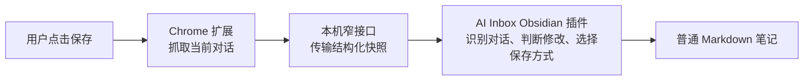

# AI Inbox 需求基线

### 0.3.0 内容设置与语言（2026-09-12）

最新规则：Obsidian 的 AI Inbox 设置增加“保存思考内容”和“在正文显示对话标题”，均默认关闭；界面语言默认跟随 Obsidian，可选简体中文和 English。Chrome 按目标仓库规则执行，需同步更新至 0.3.0。开启思考后保存已识别的展开摘要与思考活动，放在默认折叠的引用块中；普通回答/过程消息和独立图片保留，内部上下文和工具调用不导出。

改变设置不会立即改动笔记，下次保存才应用。即使源聊天没变化也更新格式；本地改过则另存新笔记。旧连接、索引和文件位置保留。176 项自动测试及受控浏览器 / 实际 Obsidian 联调通过；并已操作原生语言控件、标题开关验证持久化和即时刷新。真实 ChatGPT 思考样本尚未独立核对。

日期：2026-09-10  
版本：1.0  
状态：用户已确认产品边界；详细技术方案见 `detailed-design.md`，执行计划见 `development-plan.md`。

## 1. 依据与取舍

需求来源：项目需求讨论及后续确认；本文件为可公开的需求基线。

以用户后续收敛的意见为准。对话早期出现的 AI Processor、Source / Inbox / Note 三层界面、Follow、Detach、自动处理、知识拆分等建议，不属于已接受需求。对话中的竞品数据、市场判断和技术建议不直接作为已经验证的事实。

本基线形成时项目尚未开始实现。2026-09-12 已推进至 Alpha，实际实现和验收状态见 `alpha-testing.md`；以下用户决策保持有效。

2026-09-12 最新确认补充（优先于早期连接讨论）：图片遵循 Obsidian 默认附件位置；自动发现运行中仓库，首次确认一次配对，去掉复制粘贴连接信息；多个仓库可选择并记为默认，用户随时改选且改选即默认；目标未运行时直接失败，不离线暂存、不提供启动 Obsidian 的按钮、不改投其他仓库。工具栏图标重新设计，仍保持各状态一致与一键保存。

## 2. 用户已经表达的核心需求

| 编号 | 需求 | 含义 |
| --- | --- | --- |
| R01 | 一键保存当前聊天的全部内容 | 点击按钮即保存当前聊天的完整对话；不选择消息、问答轮次或片段，不提供导出范围选项 |
| R02 | 保存 ChatGPT 网页对话 | 将原始对话带入 Obsidian，方便用户后续整理 |
| R03 | 允许重复保存 | 通过对话标识识别已有记录 |
| R04 | 本地未改时刷新 | 来源延续或变化后，可以刷新已有笔记 |
| R05 | 本地改过时另存 | 保留用户编辑的笔记，创建一份新的对话页面 |
| R06 | 不限制笔记编辑 | 用户可以直接修改 Markdown，不要求在指定区域写笔记 |
| R07 | 保持操作简洁 | 不把 Snapshot、Follow、Detach、冲突合并等概念暴露为日常操作 |
| R08 | 不处理知识 | 不调用模型生成摘要、标签或笔记；后续整理交给用户自己的工具 |
| R09 | 图片下载到本地 | 首版包含用户上传及助手回复中的图片，笔记引用 Vault 内的图片文件 |
| R10 | 日期时间区分新版本 | 因本地修改而另存时，在文件名中加入日期时间，冲突时追加序号 |
| R11 | 保留用户属性 | 改名、移动和仅修改 properties 不触发正文编辑判定；更新时保留当前 properties |
| R12 | 来源未变也保护本地编辑 | 只要当前目标正文已改，再次保存就新建，即使 ChatGPT 内容没有变化 |

产品描述：**点一下，保存当前 ChatGPT 聊天的全部对话和图片到 Obsidian；再次保存时，自动更新或另存，并保护本地编辑。**

R01 已按用户纠正替换：产品不提供“选择性保存”功能。这里的“当前聊天”不是账户全部历史聊天；完整性覆盖当前聊天的全部消息，而不是屏幕中可见的最后几轮。

## 3. 设计架构

- 浏览器负责捕获；Obsidian 插件负责文件定位、保存策略和落盘。
- 首选专用插件，不要求安装提供整个 Vault CRUD 能力的通用 REST 插件。
- 对话数据与渲染后的 Markdown 分别计算 hash，不能混用。
- 本地未修改时重新渲染完整对话，不实现 Markdown 增量拼接或三方合并。
- 一条对话只维护一个当前更新目标。因本地修改而另存后，新文件成为目标，历史文件不再参与后续更新。
- Markdown 保持可独立阅读；内部 hash、请求状态等不塞入正文。

## 4. 用户已确认的决策（2026-09-10）

### D01：首版范围

已确认：Chrome 扩展 + 专用 Obsidian 桌面插件；ChatGPT 当前完整聊天；Windows 优先验证；首版直接下载图片。移动端、多设备同时保存、多来源、批量导入和非图片附件下载后置。非图片附件保留名称及可获得的引用。

### D02：本地修改的定义

已确认：改名和仓库内移动不触发另存；frontmatter/properties 修改保留，允许刷新正文；正文任何编辑触发另存。

### D03：来源不变、本地已改

已确认：再次主动保存时创建一份原始对话，新文件成为后续更新目标。新文件名加入日期时间。判定顺序是先判断本地修改，再判断来源是否变化。

### D04：扩展操作

已确认：扩展选项和配置尽可能少，日常只有一个保存按钮。不做消息勾选、范围选择、模式选择、每次预览或保存前确认。首次连接目标 Vault 是必要的一次性设置，不是每次保存步骤。

## 5. 需要在详细设计中解决的技术问题

以下属于工程设计任务，不需要把每项都交给用户决定。

1. **完整性**：页面可见内容不一定是完整对话；加载中、长对话、分支、重新生成、代码和公式都需要测试样本。不能把抓取不到的旧消息误认为来源删除。
2. **写入期间的编辑**：先读取、判断 hash、再直接覆盖存在竞态；最终写入必须重新核验正文，并验证打开编辑器时的行为。
3. **保留 properties**：如果只计算正文 hash，就必须保留用户 frontmatter；不能因重新渲染整份文件而丢失标签、注释或其他属性。
4. **身份与路径**：文件改名、移动、删除、复制、修改来源属性、索引遗失等情况下，不能只靠文件名猜测更新对象。
5. **失败恢复**：Markdown 写入成功但索引写入失败、响应丢失、浏览器重复请求和应用重启不能导致错误覆盖或反复新建。
6. **浏览器生命周期**：Manifest V3 service worker 会退出，不能仅用内存变量保存未完成请求。
7. **本机接口**：限定 loopback 地址、鉴权、固定接口与输入校验；网页内容不能控制写入路径或把扩展变成任意网络代理。
8. **多仓库**：保存前绑定明确的目标 Vault，端口冲突时显式报错，不能把对话写到先响应的任意仓库。
9. **状态同步**：状态写进插件目录不等于自动具备跨设备一致性。需要明确首版单写入端边界，以及索引缺失时保守恢复行为。
10. **陈旧快照**：旧标签页、网络重试、分支切换可能携带较旧内容；需要区分重试与一次新的主动保存，不能用客户端时钟直接断言内容更新。

## 6. 已核对的官方技术依据

- Obsidian 官方建议使用 `Vault.process()` 处理依赖当前内容的更新，并在回调中检查异步准备期间文件是否变化。这是保存保护的实现依据，不代表外部同步程序或所有编辑器状态已经经过本项目验证。[Vault 文档](https://docs.obsidian.md/Plugins/Vault)
- Chrome 扩展的跨域请求应由具有 host permissions 的扩展上下文发起；content script 仍受网页来源约束。浏览器侧采用 content script → service worker → 本机接口的分工。[跨域请求](https://developer.chrome.com/docs/extensions/develop/concepts/network-requests)
- Chrome service worker 可能终止，关键请求状态不能只存全局变量；需要可恢复的有限状态和幂等请求标识。[生命周期](https://developer.chrome.com/docs/extensions/develop/concepts/service-workers/lifecycle)
- `chrome.storage.local` 有容量限制，默认可被 content scripts 访问，可以通过访问级别收紧。连接凭据、缓存容量和清理策略必须明确。[Storage API](https://developer.chrome.com/docs/extensions/reference/api/storage)
- 开发和验收应使用专用测试 Vault。[Obsidian 插件入门](https://docs.obsidian.md/Plugins/Getting%20started/Build%20a%20plugin)

## 7. 文档关系

- `detailed-design.md`：产品行为、架构、数据与接口契约、图片、保护和恢复策略。
- `development-plan.md`：阶段依赖、任务编号、交付物、工作量、验收门槛。
- `acceptance-tests.md`：由需求与故障场景推导的验收用例。

用户明确决策优先于工程建议。技术验证失败时应记录证据、修订实现方案；不能静默缩减“完整聊天”“图片本地化”或“保护本地编辑”三项核心需求。
